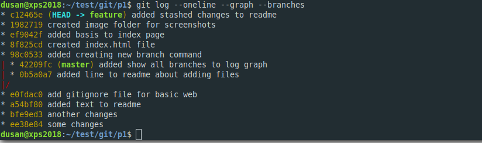
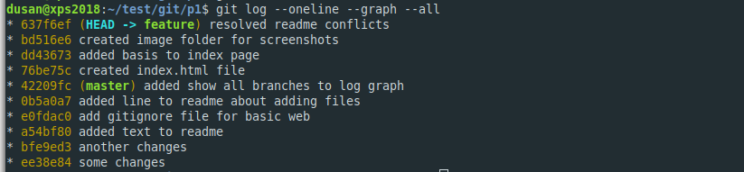

# Git training

This project is git training with some immediate advanced commands.

## Basics

Here some 'quick' basic commands are listed

```bash
  # initialize git repo
  git init

  # add remote
  git remote add origin git@github.com:dmijatovic/git-practice-1.git

  # view remotes
  git remove -v

  # fetch changes from remote repo (get it to origin branches)
  git fetch

  # pull changes from remote repo into local branch
  git pull origin master

  # push changes
  git push origin master

  # push to master and set upstream branch to track changes
  git push -u origin master

  # create new branch (from branch you are currently on) and switch to it
  git checkout -b feature


```

## Git status and logs

```bash
  # show current status of repo
  git status

  # show basic changes
  git log

  # show changes in one line using graph
  git log --oneline --graph
  # show changes as graph for all branches (not stashes/tag)
  git log --oneline --graph --branches
  # show changes as graph incl stashes and tags(?)
  git log --oneline --graph --all

```

## Git commit (save changes)

When commit command is issued all files that are STAGED are committed to CURRENT branch the user is on. So this command depends on command to stage the files.

```bash

  # commit STAGED files
  git commit -m "This is my message"

  # commit STAGED and UNSTAGED files - BUT NOT UNTRACKED (new) files
  git commit -am "This is my message"

  # add all untracked files (or you can add by filename)
  git add .


```

## Comparing changes with Git

Use git diff command or difftool. (if defined)

### Define git difftool to be VSCode


## Rebasing in git

The common approach is to rebase feature/fix branch with the changes from the master. This will pull changes from master branch and then replay your changes on the top of it. 

The approach will work perfectly if the changes are not made on the same files, otherwise the conficts might arise.

### Rebasing with conflicts

Before rebasing the git tree will looks something like this. In this example feature branch is ahead of master by 5 commits and there are 2 commits in master (0b5a0a7,42209fc) which are not included in feature branch.



Then we did this

```bash

  # swith to feature branch
  git checkout feature

  # rebase feature branch with changes from master
  # you need to be in CLEAN state (not having uncommited/staged changes)
  git rebase master

  # we had merge conflicts with fist commit 0b5a0a7 so we skipped it
  git rebase --skip

  # we had merege conflict with second commit but resolved it and continue
  git add .
  git commit -m "resolved readme conflicts"
  
  # continue with rebase
  git rebase --continue

```

After rebase and resolved conflicts, the log graph looks like this.



Then we merge everything into master and get this
