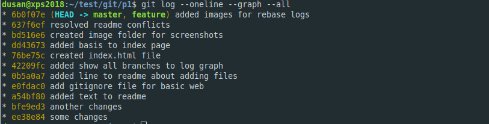

# Git training

This project is git training with some immediate advanced commands.

## Basics

Here some 'quick' basic commands are listed

```bash
  # initialize git repo
  git init

  # add remote
  git remote add origin git@github.com:dmijatovic/git-practice-1.git

  # view remotes
  git remove -v

  # fetch changes from remote repo (get it to origin branches)
  git fetch

  # pull changes from remote repo into local branch
  git pull origin master

  # push changes
  git push origin master

  # push to master and set upstream branch to track changes
  git push -u origin master

  # create new branch (from branch you are currently on) and switch to it
  git checkout -b feature


```

## Git status and logs

```bash
  # show current status of repo
  git status

  # show basic changes
  git log

  # show changes in one line using graph
  git log --oneline --graph
  # show changes as graph for all branches (not stashes/tag)
  git log --oneline --graph --branches
  # show changes as graph incl stashes and tags(?)
  git log --oneline --graph --all

```

## Git commit (save changes)

When commit command is issued all files that are STAGED are committed to CURRENT branch the user is on. So this command depends on command to stage the files.

```bash

  # commit STAGED files
  git commit -m "This is my message"

  # commit STAGED and UNSTAGED files - BUT NOT UNTRACKED (new) files
  git commit -am "This is my message"

  # add all untracked files (or you can add by filename)
  git add .


```

## Git merge

Git merge with accepting confict changes by default

```bash
# merge branch and accept all their changes when conflicts
git merge <branch-name> --strategy-option theirs

# merge branch and accept all our changes when conflicts
git merge <branch-name> --strategy-option ours
```

## Rebasing in git

The common approach is to rebase feature/fix branch with the changes from the master. This will pull changes from master branch and then replay your changes on the top of it.

The approach will work perfectly if the changes are not made on the same files, otherwise the conficts might arise.

### Rebasing with conflicts

Before rebasing the git tree will looks something like this. In this example feature branch is ahead of master by 5 commits and there are 2 commits in master (0b5a0a7,42209fc) which are not included in feature branch.


Then we did this

```bash

  # swith to feature branch
  git checkout feature

  # rebase feature branch with changes from master
  # you need to be in CLEAN state (not having uncommited/staged changes)
  git rebase master

  # we had merge conflicts with fist commit 0b5a0a7 so we skipped it
  # note that feature commit 98c0533 was skipped (not included in end solution)
  # I AM SKIPPING commit 98c0533 from feature branch
  git rebase --skip

  # we had merege conflict with second commit but resolved it and continue
  git add .
  git commit -m "resolved readme conflicts"

  # continue with rebase
  git rebase --continue

```

After rebase and resolved conflicts, the log graph looks like this. I skipped feature commit 98c0533 which is not included in the end solution. Also note that commit hashes of alle feature commits are CHANGED after rebase. For example 8f825cd "created index.html file" become 76be75c after rebasing. This happens because rebase replays original commits on the top of commits pulled from master. This is the reason WHY rebasing AFTER the commits are pushed to remote repo can cause problems.


After merging everything into master, which is then Fast Forward, we get this.



Note! You can force merge commit if you want (I would not know why).

```bash
  # on master branch merge feature branch and force merge
  git merge feature --no-ff -am "Merged feature into master"
```

### Rebasing your local branch with changes from remote

Other handy use of rebase is when you want to pull changes from remote branch and you already have commits in your branch. You can do this combining pull and rebase.

```bash
  # pull changes from remote and replay my local commits
  # on the top if these
  git pull --rebase origin master

```

## Setup VSCode as git tool

- Check if VSCode is registred in your PATH.

```bash
  # open terminal and type
  # if this opens Visual Studio Code then you can proceed
  # otherwise google how to add VSCode to your path
  code .

```

- Define VSCode to be your code editor for Git

```bash
  # set code as git core editor
  git config --global core.editor code

  # check if it works
  git config --global -e
```

- Define VSCode to be your diff tool

```bash
  # see current dif tool
  git config --global --get diff.tool

  # open .gitconfig file for editing
  git config --global -e

```

Add following lines to .gitconfig

```gitconfig

[diff]
  tool = vscode

[difftool "vscode"]
  cmd = code --wait --diff $LOCAL $REMOTE

```

- To turnoff difftool prompt before opening

```bash
  git config --global difftool.prompt false

```

- Alternative difftoll app is [kdiff3](http://kdiff3.sourceforge.net/) which can also compare complete folders without beeing git repos.

```bash
  # on linux ubuntu/debian use apt
  # otherwise download and install
  sudo apt install kdiff3

```
